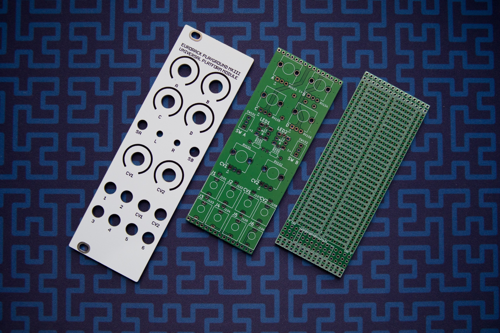
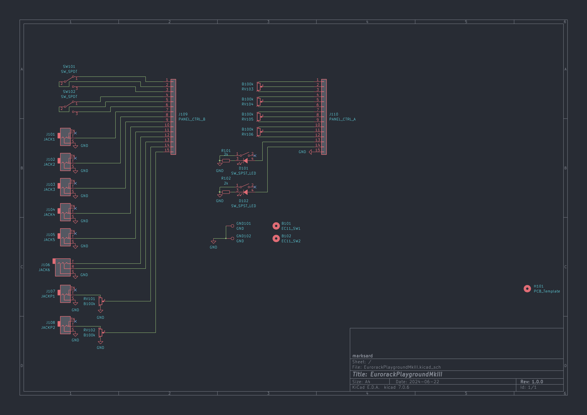
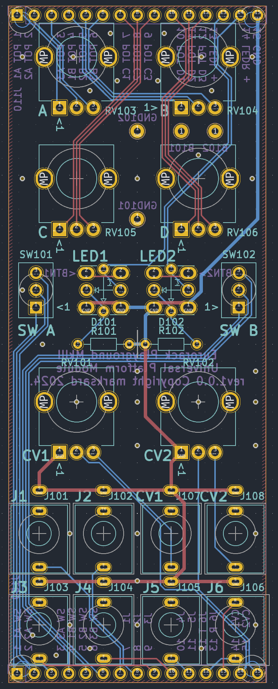
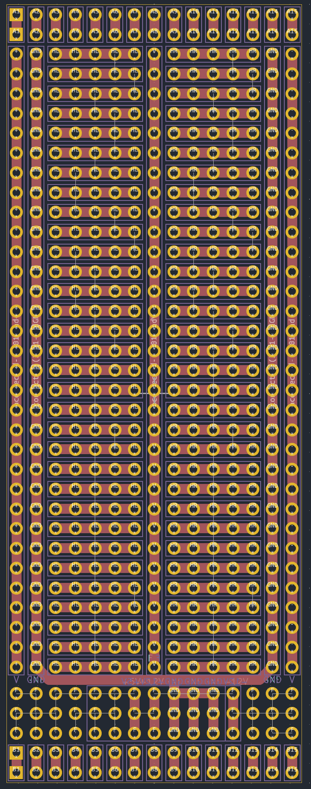

# EurorackPlaygroundMkIII
8HP Eurorack module system that can be built with breadboard PCB

## BOM

|Reference|Footprint|Number of pieces|
|:--|:--|:--|
|D101, D102|3mm LED|2|
|J101-J105, J107, J108|WQP-PJ398SM or WQP-WQP518MA|7|
|J106|WQP-PJ366ST or WQP-PJ398SM or WQP-WQP518MA|1|
|J109, J110|PinHeader 1x15 P2.54mm|2|
|R101, R102|Resistor 2k|2|
|RV101-RV106|RK09L|6|
|SW101, SW102|SPDT Switch (2MS1T2B4M2QES)|2|

## Schematic

  

## Interface PCB

  

  

## Breadboard PCB

  

## Panel Template

  

## Demonstration

