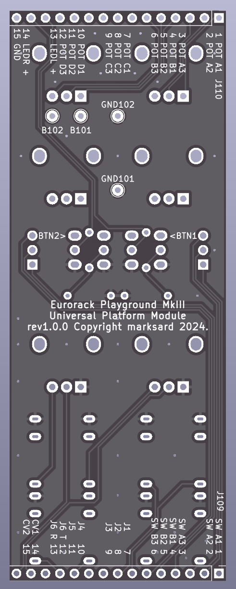

# EurorackPlaygroundMkIII
8HP Eurorack module system that can be built with breadboard PCB

## Specification

### Panel interface

|Name|Description|
|:--|:--|
|Jack 1|Mini phone mono|
|Jack 2|Mini phone mono|
|Jack 3|Mini phone mono|
|Jack 4|Mini phone mono|
|Jack 5|Mini phone mono|
|Jack 6|Mini phone stereo|
|CV 1|Mini phone mono with pot|
|CV 2|Mini phone mono with pot|
|POT A||
|POT B||
|POT C||
|POT D||

|LED 1|3mm LED|
|LED 2|3mm LED|
|SW 1|SPDT|
|SW 2|SPDT|

## Image

## Schematic

  
  
  

## Demonstration
